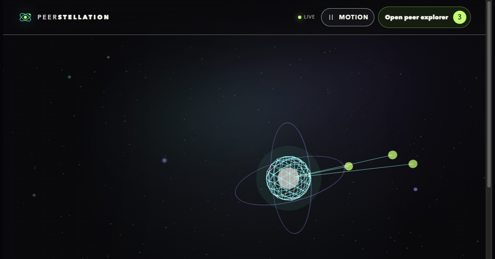
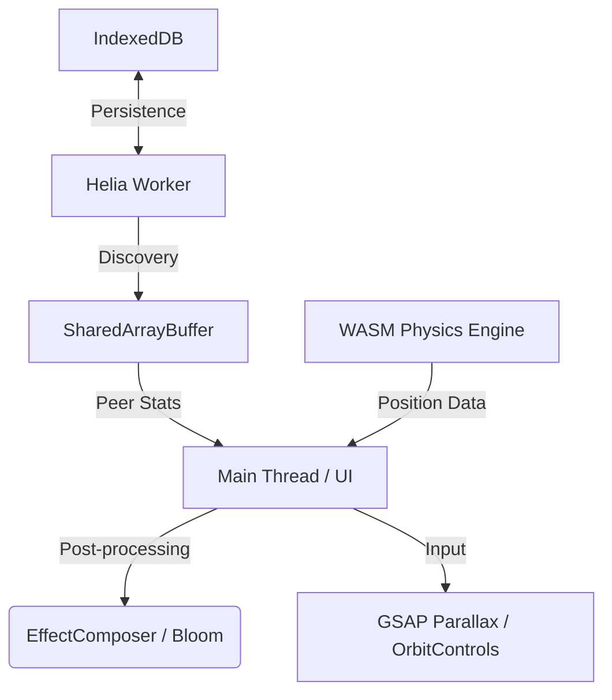

# 🌌 IPFS Universe 2.0



> **A premium, real-time 3D visualization of the IPFS network.**
> Powered by **WebGPU**, **WASM (Zig/Rust)**, and **Helia**.

[](https://ipfsuniverse.xyz)
[](https://github.com/tadanobutubutu/ipfs-universe)
[](LICENSE)

---

## ✨ Overview

**IPFS Universe** is a cutting-edge engine designed to visualize the decentralized structure of the InterPlanetary File System. By leveraging modern web technologies, it transforms abstract network peer connections into a cinematic, interactive 3D celestial experience.

### 💎 Premium Design & UX

- **Orbitron Typography**: Futuristic, high-tech visual identity.
- **Glassmorphism HUD**: Translucent, blurred UI panels for a premium "Mission Control" feel.
- **Cinematic Bloom**: Unreal-style post-processing for glowing particles and core.
- **Interactive Parallax**: Dynamic HUD tilting based on mouse movement for deep spatial immersion.

---

## 🛠 Technology Stack

### 🚀 High-Performance Engine

- **Three.js r168**: The backbone of the 3D rendering pipeline.
- **WebGPU Native**: Utilizing the latest browser graphics API for thousands of simultaneous particles.
- **WebGL 1.0 Fallback**: Intelligent detection for older devices/browsers.

### ⚙️ WASM-Accelerated Physics

- **Zig & Rust WASM**: Core physics calculations (velocity, gravity, collision) are handled in WebAssembly, bypassing JavaScript's garbage collection and main-thread overhead.
- **SharedArrayBuffer**: Lock-free concurrency using `Atomics` to sync peer data between Workers and the Main Thread.

### 🌐 Decentralized Core

- **Helia (IPFS)**: A full IPFS node running directly in your browser. No central relays, just pure P2P.
- **IndexedDB**: Persistent storage for peer history and network metadata via `idb`.
- **MetaMask Integration**: Connect your wallet to generate a unique Node ID and customize your universe's aesthetic.

---

## 📦 Architecture



---

## 🚀 Getting Started

```bash
# 1. Clone the repository
git clone https://github.com/tadanobutubutu/ipfs-universe.git

# 2. Enter the void
cd ipfs-universe

# 3. Install dependencies
npm install

# 4. Ignite the engine
npm run ipfsuniverse
```

### 🏠 Local Development (Workspace)

When running inside the parent workspace alongside other projects (e.g. Remotion), use the dedicated command:

```bash
# From workspace root
npm run ipfsuniverse          # Start IPFS Universe dev server (port 5173)
npm run ipfsuniverse:build    # Production build

# Or directly from ipfs-universe/
cd ipfs-universe && npm run ipfsuniverse
```

---

## 📜 Dev Rituals

The project maintains a **Legacy XHR Ritual** layer. While modern nodes use `Fetch`, we retain `XMLHttpRequest` for network probing as a tribute to the early days of the web. Trigger it via the **Probe Network** button in the HUD.

---

Built with 🌌 by [tadanobutubutu](https://github.com/tadanobutubutu)

